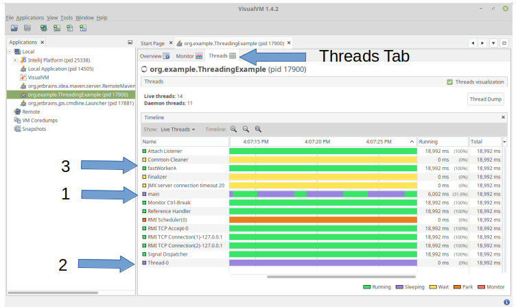

# Thread Dumps

## What is a thread?

Fully explaining threading is beyond the
scope of this firefighting guide.  We assume
readers are well versed in concurrency and 
threading in software systems.  If not,
some background may be reviewed here. 

[Educative.io blog on threading](https://www.educative.io/blog/multithreading-and-concurrency-fundamentals
)

#### Quick summary of threading

Everything you run on any software system
is done by a thread.  The primary thread
of any program is the main thread.

You start additional threads other than the main 
thread when you  
do work independently, and in parallel.

Typically threads interact with each other
by passing information to other threads
using memory.  

Languages like Java, C++, Rust
and others support threading and will natively
run the software in parallel.  The operating system,
usually Linux, schedules the threads to run 
using a part of the kernel called a scheduler.

Generally you can run at least as many threads
as there are cores on your machine.  You are
free to start as many threads as you want.  Once
you have exceeded the number of cores on your system,
the operating system scheduler gives each thread
a slice of time to run on a core.  The operating
system code takes care of the heavy lifting of 
recording where the thread was last running,
and then continuing exactly where the thread
has been running, when a core becomes available.

## Anatomy of a thread

Each thread in any software system
has an instruction it is running.
The calls which led to this instruction running
are the call stack.

Next we will examine the threads from 
the threading example in the examples
code associated with this blog, which
can be found here:  

[Example Code Repo](https://github.com/crodier/software-blog-examples)

[Threading Java Class:  ThreadingExample.java](https://github.com/crodier/software-blog-examples/blob/main/examples/src/main/java/org/example/ThreadingExample.java)

You can safely checkout and run this example "main" 
method from ThreadingExample.java.

The sample program starts and runs two threads
and continues the main thread of execution. 
All three threads use 
```while(true)``` loops which never exit, running forever.  

Later we will examine this specific programs threads.

## What is a thread dump?

A thread dump instructs the software system
to log whatever information it has about every 
thread of execution in the system.
The most valuable piece of information is 
stating exactly which line in the code every 
thread is running.  This is followed by the "call stack",
which is the chain of calls through the software
system which led to the line of code being run
in each thread.  Java makes these easy to read,
and provides two summary lines above this 
important thread information.  Any thread has a 
"state" which it is in.  Java reports 
these states for example, RUNNABLE,
WAITING, TIMED_WAITING (as a result of "sleep"),
and a few others.  The thread name and other
key thread statistics are also listed by the JVM
when a thread dump is generated.

We will review a Java thread dump, and 
then use the concepts to review C++ and others.

## Examples of a Java thread dump

For the "Threading Example" linked above,
here is a thread dump generated on my linux machine.

First let us review one small 
chunk of the overall thread dump command output.

In this one snippet, we can quickly observe that
a thread named "fastWorkerA"
is RUNNABLE and running line 34 of ThreadingExample.java.
```
"fastWorkerA" #14 prio=5 os_prio=0 cpu=54071.49ms elapsed=54.12s tid=0x00007f6b2c301800 nid=0x306e runnable  [0x00007f6b001e5000]
java.lang.Thread.State: RUNNABLE
at org.example.ThreadingExample$FastWorker.run(ThreadingExample.java:34)
at java.lang.Thread.run(java.base@11.0.16/Thread.java:829)
```
Notably this line 34 in the sample java program 
is testing if a counter has exceeded "MAX_VALUE".
When we take more thread dumps, fastWorkerA is almost always on this
specific line; most likely because it is the slowest line
executed in every loop, the other being incrementing the counter.

```java
if (counter == Integer.MAX_VALUE) {
```

### Entire thread dump output, followed by discussion
Next let us review the complete thread dump output for this
three thread java program "ThreadingExample.java".

First take a moment and read through this output.

There are 13 threads in total; three are threads
from our own ThreadingExample.java, and the other
ten are JVM threads we do not control.
As you typically do not review the JVM controlled
threads, a JVM option should exist to avoid this 
part of the output, but it does not, 
and instead, we see our three threads "main", "fastWorkerA", and "Thread-0"
intertwined with the 10 JVM threads.  Each thread dump block
begins 
with the name of the thread in quotes, and we can see "main" is the first 
thread dumped to output.

Start by scanning the output quickly.  
Do not try to understand the output now.
```
2023-01-01 13:27:32
Full thread dump OpenJDK 64-Bit Server VM (11.0.16+8-post-Ubuntu-0ubuntu118.04 mixed mode, sharing):

Threads class SMR info:
_java_thread_list=0x00007f6ac80089a0, length=18, elements={
0x00007f6b2c018800, 0x00007f6b2c234000, 0x00007f6b2c236000, 0x00007f6b2c23b800,
0x00007f6b2c23d800, 0x00007f6b2c23f800, 0x00007f6b2c241800, 0x00007f6b2c243800,
0x00007f6b2c261800, 0x00007f6b2c2fc000, 0x00007f6b2c2ff800, 0x00007f6b2c301800,
0x00007f6ae0001000, 0x00007f6ab40fb800, 0x00007f6ac8005800, 0x00007f6aac07f000,
0x00007f6aac086000, 0x00007f6ac8007000
}

"main" #1 prio=5 os_prio=0 cpu=120.01ms elapsed=54.23s tid=0x00007f6b2c018800 nid=0x305b waiting on condition  [0x00007f6b361d4000]
java.lang.Thread.State: TIMED_WAITING (sleeping)
at java.lang.Thread.sleep(java.base@11.0.16/Native Method)
at org.example.ThreadingExample.main(ThreadingExample.java:66)

Locked ownable synchronizers:
- None

"Reference Handler" #2 daemon prio=10 os_prio=0 cpu=0.17ms elapsed=54.22s tid=0x00007f6b2c234000 nid=0x3062 waiting on condition  [0x00007f6b014f8000]
java.lang.Thread.State: RUNNABLE
at java.lang.ref.Reference.waitForReferencePendingList(java.base@11.0.16/Native Method)
at java.lang.ref.Reference.processPendingReferences(java.base@11.0.16/Reference.java:241)
at java.lang.ref.Reference$ReferenceHandler.run(java.base@11.0.16/Reference.java:213)

Locked ownable synchronizers:
- None

"Finalizer" #3 daemon prio=8 os_prio=0 cpu=0.28ms elapsed=54.22s tid=0x00007f6b2c236000 nid=0x3063 in Object.wait()  [0x00007f6b013f7000]
java.lang.Thread.State: WAITING (on object monitor)
at java.lang.Object.wait(java.base@11.0.16/Native Method)
- waiting on <0x00000007195024e8> (a java.lang.ref.ReferenceQueue$Lock)
at java.lang.ref.ReferenceQueue.remove(java.base@11.0.16/ReferenceQueue.java:155)
- waiting to re-lock in wait() <0x00000007195024e8> (a java.lang.ref.ReferenceQueue$Lock)
at java.lang.ref.ReferenceQueue.remove(java.base@11.0.16/ReferenceQueue.java:176)
at java.lang.ref.Finalizer$FinalizerThread.run(java.base@11.0.16/Finalizer.java:170)

Locked ownable synchronizers:
- None

"Signal Dispatcher" #4 daemon prio=9 os_prio=0 cpu=0.35ms elapsed=54.22s tid=0x00007f6b2c23b800 nid=0x3064 runnable  [0x0000000000000000]
java.lang.Thread.State: RUNNABLE

Locked ownable synchronizers:
- None

"Service Thread" #5 daemon prio=9 os_prio=0 cpu=0.06ms elapsed=54.21s tid=0x00007f6b2c23d800 nid=0x3065 runnable  [0x0000000000000000]
java.lang.Thread.State: RUNNABLE

Locked ownable synchronizers:
- None

"C2 CompilerThread0" #6 daemon prio=9 os_prio=0 cpu=817.05ms elapsed=54.21s tid=0x00007f6b2c23f800 nid=0x3066 waiting on condition  [0x0000000000000000]
java.lang.Thread.State: RUNNABLE
No compile task

Locked ownable synchronizers:
- None

"C1 CompilerThread0" #9 daemon prio=9 os_prio=0 cpu=483.65ms elapsed=54.21s tid=0x00007f6b2c241800 nid=0x3067 waiting on condition  [0x0000000000000000]
java.lang.Thread.State: RUNNABLE
No compile task

Locked ownable synchronizers:
- None

"Sweeper thread" #10 daemon prio=9 os_prio=0 cpu=0.11ms elapsed=54.21s tid=0x00007f6b2c243800 nid=0x3068 runnable  [0x0000000000000000]
java.lang.Thread.State: RUNNABLE

Locked ownable synchronizers:
- None

"Common-Cleaner" #11 daemon prio=8 os_prio=0 cpu=0.18ms elapsed=54.18s tid=0x00007f6b2c261800 nid=0x3069 in Object.wait()  [0x00007f6b00b13000]
java.lang.Thread.State: TIMED_WAITING (on object monitor)
at java.lang.Object.wait(java.base@11.0.16/Native Method)
- waiting on <0x0000000719546188> (a java.lang.ref.ReferenceQueue$Lock)
at java.lang.ref.ReferenceQueue.remove(java.base@11.0.16/ReferenceQueue.java:155)
- waiting to re-lock in wait() <0x0000000719546188> (a java.lang.ref.ReferenceQueue$Lock)
at jdk.internal.ref.CleanerImpl.run(java.base@11.0.16/CleanerImpl.java:148)
at java.lang.Thread.run(java.base@11.0.16/Thread.java:829)
at jdk.internal.misc.InnocuousThread.run(java.base@11.0.16/InnocuousThread.java:161)

Locked ownable synchronizers:
- None

"Monitor Ctrl-Break" #12 daemon prio=5 os_prio=0 cpu=10.47ms elapsed=54.12s tid=0x00007f6b2c2fc000 nid=0x306b runnable  [0x00007f6b004ea000]
java.lang.Thread.State: RUNNABLE
at java.net.SocketInputStream.socketRead0(java.base@11.0.16/Native Method)
at java.net.SocketInputStream.socketRead(java.base@11.0.16/SocketInputStream.java:115)
at java.net.SocketInputStream.read(java.base@11.0.16/SocketInputStream.java:168)
at java.net.SocketInputStream.read(java.base@11.0.16/SocketInputStream.java:140)
at sun.nio.cs.StreamDecoder.readBytes(java.base@11.0.16/StreamDecoder.java:284)
at sun.nio.cs.StreamDecoder.implRead(java.base@11.0.16/StreamDecoder.java:326)
at sun.nio.cs.StreamDecoder.read(java.base@11.0.16/StreamDecoder.java:178)
- locked <0x000000071938c4e0> (a java.io.InputStreamReader)
at java.io.InputStreamReader.read(java.base@11.0.16/InputStreamReader.java:181)
at java.io.BufferedReader.fill(java.base@11.0.16/BufferedReader.java:161)
at java.io.BufferedReader.readLine(java.base@11.0.16/BufferedReader.java:326)
- locked <0x000000071938c4e0> (a java.io.InputStreamReader)
at java.io.BufferedReader.readLine(java.base@11.0.16/BufferedReader.java:392)
at com.intellij.rt.execution.application.AppMainV2$1.run(AppMainV2.java:47)

Locked ownable synchronizers:
- None

"Thread-0" #13 prio=5 os_prio=0 cpu=19.85ms elapsed=54.12s tid=0x00007f6b2c2ff800 nid=0x306d waiting on condition  [0x00007f6b002e7000]
java.lang.Thread.State: TIMED_WAITING (sleeping)
at java.lang.Thread.sleep(java.base@11.0.16/Native Method)
at org.example.ThreadingExample$SlowWorker.run(ThreadingExample.java:13)
at java.lang.Thread.run(java.base@11.0.16/Thread.java:829)

Locked ownable synchronizers:
- None

"fastWorkerA" #14 prio=5 os_prio=0 cpu=54071.49ms elapsed=54.12s tid=0x00007f6b2c301800 nid=0x306e runnable  [0x00007f6b001e5000]
java.lang.Thread.State: RUNNABLE
at org.example.ThreadingExample$FastWorker.run(ThreadingExample.java:34)
at java.lang.Thread.run(java.base@11.0.16/Thread.java:829)

Locked ownable synchronizers:
- None

"Attach Listener" #15 daemon prio=9 os_prio=0 cpu=236.16ms elapsed=53.17s tid=0x00007f6ae0001000 nid=0x3080 waiting on condition  [0x0000000000000000]
java.lang.Thread.State: RUNNABLE

Locked ownable synchronizers:
- None

"RMI TCP Accept-0" #17 daemon prio=9 os_prio=0 cpu=1.40ms elapsed=44.07s tid=0x00007f6ab40fb800 nid=0x30f2 runnable  [0x00007f6b00a12000]
java.lang.Thread.State: RUNNABLE
at java.net.PlainSocketImpl.socketAccept(java.base@11.0.16/Native Method)
at java.net.AbstractPlainSocketImpl.accept(java.base@11.0.16/AbstractPlainSocketImpl.java:474)
at java.net.ServerSocket.implAccept(java.base@11.0.16/ServerSocket.java:565)
at java.net.ServerSocket.accept(java.base@11.0.16/ServerSocket.java:533)
at sun.management.jmxremote.LocalRMIServerSocketFactory$1.accept(jdk.management.agent@11.0.16/LocalRMIServerSocketFactory.java:52)
at sun.rmi.transport.tcp.TCPTransport$AcceptLoop.executeAcceptLoop(java.rmi@11.0.16/TCPTransport.java:394)
at sun.rmi.transport.tcp.TCPTransport$AcceptLoop.run(java.rmi@11.0.16/TCPTransport.java:366)
at java.lang.Thread.run(java.base@11.0.16/Thread.java:829)

Locked ownable synchronizers:
- None

"RMI TCP Connection(1)-127.0.0.1" #18 daemon prio=9 os_prio=0 cpu=197.56ms elapsed=44.06s tid=0x00007f6ac8005800 nid=0x30f4 runnable  [0x00007f6abf8ec000]
java.lang.Thread.State: RUNNABLE
at java.net.SocketInputStream.socketRead0(java.base@11.0.16/Native Method)
at java.net.SocketInputStream.socketRead(java.base@11.0.16/SocketInputStream.java:115)
at java.net.SocketInputStream.read(java.base@11.0.16/SocketInputStream.java:168)
at java.net.SocketInputStream.read(java.base@11.0.16/SocketInputStream.java:140)
at java.io.BufferedInputStream.fill(java.base@11.0.16/BufferedInputStream.java:252)
at java.io.BufferedInputStream.read(java.base@11.0.16/BufferedInputStream.java:271)
- locked <0x0000000718c5ff48> (a java.io.BufferedInputStream)
at java.io.FilterInputStream.read(java.base@11.0.16/FilterInputStream.java:83)
at sun.rmi.transport.tcp.TCPTransport.handleMessages(java.rmi@11.0.16/TCPTransport.java:544)
at sun.rmi.transport.tcp.TCPTransport$ConnectionHandler.run0(java.rmi@11.0.16/TCPTransport.java:796)
at sun.rmi.transport.tcp.TCPTransport$ConnectionHandler.lambda$run$0(java.rmi@11.0.16/TCPTransport.java:677)
at sun.rmi.transport.tcp.TCPTransport$ConnectionHandler$$Lambda$90/0x00000008400bc440.run(java.rmi@11.0.16/Unknown Source)
at java.security.AccessController.doPrivileged(java.base@11.0.16/Native Method)
at sun.rmi.transport.tcp.TCPTransport$ConnectionHandler.run(java.rmi@11.0.16/TCPTransport.java:676)
at java.util.concurrent.ThreadPoolExecutor.runWorker(java.base@11.0.16/ThreadPoolExecutor.java:1128)
at java.util.concurrent.ThreadPoolExecutor$Worker.run(java.base@11.0.16/ThreadPoolExecutor.java:628)
at java.lang.Thread.run(java.base@11.0.16/Thread.java:829)

Locked ownable synchronizers:
- <0x0000000718df69c8> (a java.util.concurrent.ThreadPoolExecutor$Worker)

"RMI Scheduler(0)" #19 daemon prio=9 os_prio=0 cpu=1.24ms elapsed=44.03s tid=0x00007f6aac07f000 nid=0x30f5 waiting on condition  [0x00007f6abf7ed000]
java.lang.Thread.State: TIMED_WAITING (parking)
at jdk.internal.misc.Unsafe.park(java.base@11.0.16/Native Method)
- parking to wait for  <0x0000000718d80d08> (a java.util.concurrent.locks.AbstractQueuedSynchronizer$ConditionObject)
at java.util.concurrent.locks.LockSupport.parkNanos(java.base@11.0.16/LockSupport.java:234)
at java.util.concurrent.locks.AbstractQueuedSynchronizer$ConditionObject.awaitNanos(java.base@11.0.16/AbstractQueuedSynchronizer.java:2123)
at java.util.concurrent.ScheduledThreadPoolExecutor$DelayedWorkQueue.take(java.base@11.0.16/ScheduledThreadPoolExecutor.java:1182)
at java.util.concurrent.ScheduledThreadPoolExecutor$DelayedWorkQueue.take(java.base@11.0.16/ScheduledThreadPoolExecutor.java:899)
at java.util.concurrent.ThreadPoolExecutor.getTask(java.base@11.0.16/ThreadPoolExecutor.java:1054)
at java.util.concurrent.ThreadPoolExecutor.runWorker(java.base@11.0.16/ThreadPoolExecutor.java:1114)
at java.util.concurrent.ThreadPoolExecutor$Worker.run(java.base@11.0.16/ThreadPoolExecutor.java:628)
at java.lang.Thread.run(java.base@11.0.16/Thread.java:829)

Locked ownable synchronizers:
- None

"JMX server connection timeout 20" #20 daemon prio=9 os_prio=0 cpu=13.83ms elapsed=44.02s tid=0x00007f6aac086000 nid=0x30f6 in Object.wait()  [0x00007f6abf6ec000]
java.lang.Thread.State: TIMED_WAITING (on object monitor)
at java.lang.Object.wait(java.base@11.0.16/Native Method)
- waiting on <0x0000000718ccded0> (a [I)
at com.sun.jmx.remote.internal.ServerCommunicatorAdmin$Timeout.run(java.management@11.0.16/ServerCommunicatorAdmin.java:171)
- waiting to re-lock in wait() <0x0000000718ccded0> (a [I)
at java.lang.Thread.run(java.base@11.0.16/Thread.java:829)

Locked ownable synchronizers:
- None

"RMI TCP Connection(2)-127.0.0.1" #21 daemon prio=9 os_prio=0 cpu=72.85ms elapsed=42.97s tid=0x00007f6ac8007000 nid=0x3102 runnable  [0x00007f6abf5e9000]
java.lang.Thread.State: RUNNABLE
at java.net.SocketInputStream.socketRead0(java.base@11.0.16/Native Method)
at java.net.SocketInputStream.socketRead(java.base@11.0.16/SocketInputStream.java:115)
at java.net.SocketInputStream.read(java.base@11.0.16/SocketInputStream.java:168)
at java.net.SocketInputStream.read(java.base@11.0.16/SocketInputStream.java:140)
at java.io.BufferedInputStream.fill(java.base@11.0.16/BufferedInputStream.java:252)
at java.io.BufferedInputStream.read(java.base@11.0.16/BufferedInputStream.java:271)
- locked <0x0000000718af66b0> (a java.io.BufferedInputStream)
at java.io.FilterInputStream.read(java.base@11.0.16/FilterInputStream.java:83)
at sun.rmi.transport.tcp.TCPTransport.handleMessages(java.rmi@11.0.16/TCPTransport.java:544)
at sun.rmi.transport.tcp.TCPTransport$ConnectionHandler.run0(java.rmi@11.0.16/TCPTransport.java:796)
at sun.rmi.transport.tcp.TCPTransport$ConnectionHandler.lambda$run$0(java.rmi@11.0.16/TCPTransport.java:677)
at sun.rmi.transport.tcp.TCPTransport$ConnectionHandler$$Lambda$90/0x00000008400bc440.run(java.rmi@11.0.16/Unknown Source)
at java.security.AccessController.doPrivileged(java.base@11.0.16/Native Method)
at sun.rmi.transport.tcp.TCPTransport$ConnectionHandler.run(java.rmi@11.0.16/TCPTransport.java:676)
at java.util.concurrent.ThreadPoolExecutor.runWorker(java.base@11.0.16/ThreadPoolExecutor.java:1128)
at java.util.concurrent.ThreadPoolExecutor$Worker.run(java.base@11.0.16/ThreadPoolExecutor.java:628)
at java.lang.Thread.run(java.base@11.0.16/Thread.java:829)

Locked ownable synchronizers:
- <0x0000000718df7150> (a java.util.concurrent.ThreadPoolExecutor$Worker)

"VM Thread" os_prio=0 cpu=36.33ms elapsed=54.23s tid=0x00007f6b2c231000 nid=0x3061 runnable

"GC Thread#0" os_prio=0 cpu=4.77ms elapsed=54.23s tid=0x00007f6b2c031000 nid=0x305c runnable

"G1 Main Marker" os_prio=0 cpu=0.26ms elapsed=54.23s tid=0x00007f6b2c08e000 nid=0x305d runnable

"G1 Conc#0" os_prio=0 cpu=0.05ms elapsed=54.23s tid=0x00007f6b2c090000 nid=0x305e runnable

"G1 Refine#0" os_prio=0 cpu=0.24ms elapsed=54.23s tid=0x00007f6b2c18c800 nid=0x305f runnable

"G1 Young RemSet Sampling" os_prio=0 cpu=4.25ms elapsed=54.23s tid=0x00007f6b2c18e000 nid=0x3060 runnable  
"VM Periodic Task Thread" os_prio=0 cpu=16.41ms elapsed=54.12s tid=0x00007f6b2c2fd800 nid=0x306c waiting on condition

JNI global refs: 17, weak refs: 0

```
## VisualVM display of a thread dump

#### What is VisualVM ?
VisualVM is a graphic system for reviewing the JVM, which is
free
and open source from Oracle.  We will install
it now and briefly review it in the context of threading.

#### Installing VisualVM

On Linux Mint and Ubuntu systems, you can install visualvm with apt-get.
```shell
sudo apt-get install visualvm
```
VisualVM is itself a Java program written in Swing.
VisualVM is trivial to download and run, if you don't
wish to install it.

### VisualVM Threading Display Tab
VisualVM has a tab to display the threads in the JVM.
The tab is named "Threads", which is not the first tab
you see when you start visual VM.  When you click the "Threads" tab,
you can observe how VisualVM views threads
while they are running.  

To generate this "Threads" tab, Visual VM interrogates
the state of the threads once every second using 
[JMX (Java Management Extensions)](https://www.oracle.com/technical-resources/articles/javase/jmx.html)
Using the information from the JMX calls, VisualVM
creates this bar chart of the Java threads.

Reviewing the bar chart is a good place to begin
understanding the threading information provided by the JVM.

VisualVM retrieves this information by polling using JMX; however,
the same exact information is presented in a thread dump
of the JVM, along with more.   We will first review
the VisualVM "Threads" tab, and then later we review
the thread dump itself to see the same information
is available.



#### What threads are running?

Two types of threads run in the JVM.
*Application threads* are threads the application itself
is running, which is your code you have written.
The other threads running are *JVM internal threads.*

The ThreadingExample.java program has three 
application threads
running.  

#### (1) The "main" thread
The first application thread is "main", which is
the convention the JVM uses for the main method
which is kicked off when you start the program.
The name is always "main".  The name of this thread
can not be changed by Java programmers.

The main thread of our ThreadingExample.java starts
two more application threads.

#### (2) The "Thread-0" thread

To show an example of what not to do, ThreadingExample.java
creates an unnamed application thread.  While
you would expect in professional software development,
all threads would be named, it is not well understood
as a rule of programming, and the JVM unfortunately
does not require a name for each thread.

Here on line 48 of ThreadingExample.java, 
the unnamed thread is created by using the
single argument constructor.
```java
Thread threadA = new Thread(slowWorker);
```

If you do not give a thread
a name when it is started the JVM generates a default name
for the thread, by using a counter, and names it: **"Thread-0."**

There is a static counter in the JVM, which simply counts upwards
any time an unnamed thread is started.

#### (3) The "fastWorkerA" thread

The second application thread is created 
in ThreadingExample.java
and given a name by using the Java
constructor with three arguments, the third one
being the name.

On line 56 we create the thread to run 'fastWorker'
and name it **fastWorkerA**
```
Thread threadB = new Thread(null, fastWorker, "fastWorkerA");
```

### Review the Threads in VisualVM

We can see the third row in the VisualVM thread
output shows "fastWorkerA", as a green bar.
The green bar means the thread is in RUNNING state.

Two rows are highlighted purple in the VisualVM
tab, the 6th and 13th rows in the "Threads" window.

The first purple and green row is "main".  
Purple means sleeping thread state in VisualVM.
The main thread was sleeping at this time.
The graph displays the thread state over time,
and the "main" method is coded to count to one billion
and then sleep for three seconds.  The purple blocks
in the "main" bar show the three second sleeps, while
the green area is where the thread woke up and was 
counting to a billion, in RUNNING state.

The second purple row is running "slowWorker", 
the unnamed "Thread-0"
which was the first thread kicked off by the ThreadingExample.java program.
The SlowWorker code only wakes up briefly, compared 
to the amount of time spent sleeping.  Because the JVM
polls JMX and finds the thread to always be sleeping,
the entire bar shows purple as **sleeping** state, as 
well as the current state which is also sleeping.
The state of the threads is actually "TIMED_WAIT",
which VisualVM displays as sleeping.

# TODO: continue writing here


## Information gleaned from a thread dump

## How to interpret a thread dump

## Java thread dumps

## C++ thread dumps

## Python thread dumps

Joke, there are no threads in Python.

